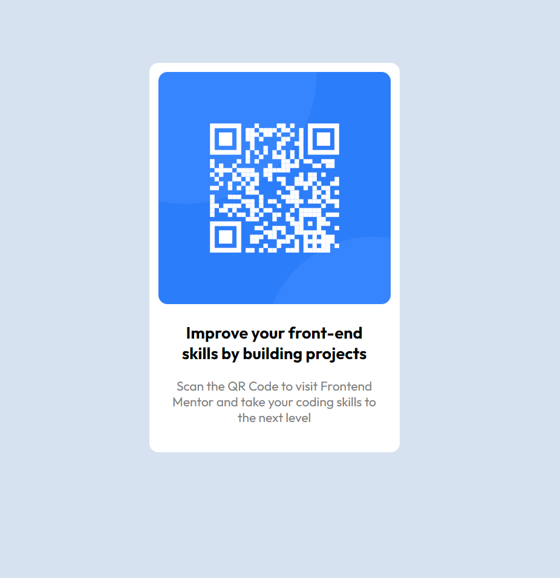

# Frontend Mentor - QR CODE COMPONENT SOLUTION

## Overview
### Screenshot

### Links

- Live Site URL: https://rui-martins23.github.io/qr-code-component-frontendmentor/

## My process

I started by structuring the HTML of this project the best I could, followed by inserting the fonts indicated in the style-guide file.
After, I tackled the styling of the project through external CCS, using flexbox and css custom properties.

### Built with

- Semantic HTML5 markup
- CSS custom properties
- Flexbox

### What I learned

Learned mostly about setting the HTML correctly, in order to make the CSS part easier.
Still had some difficulties on the styling part, but given the initial learning point where I'm at, I believe the outcome is positive.

## Author

- [@Rui-Martins23] https://www.frontendmentor.io/profile/Rui-Martins23
